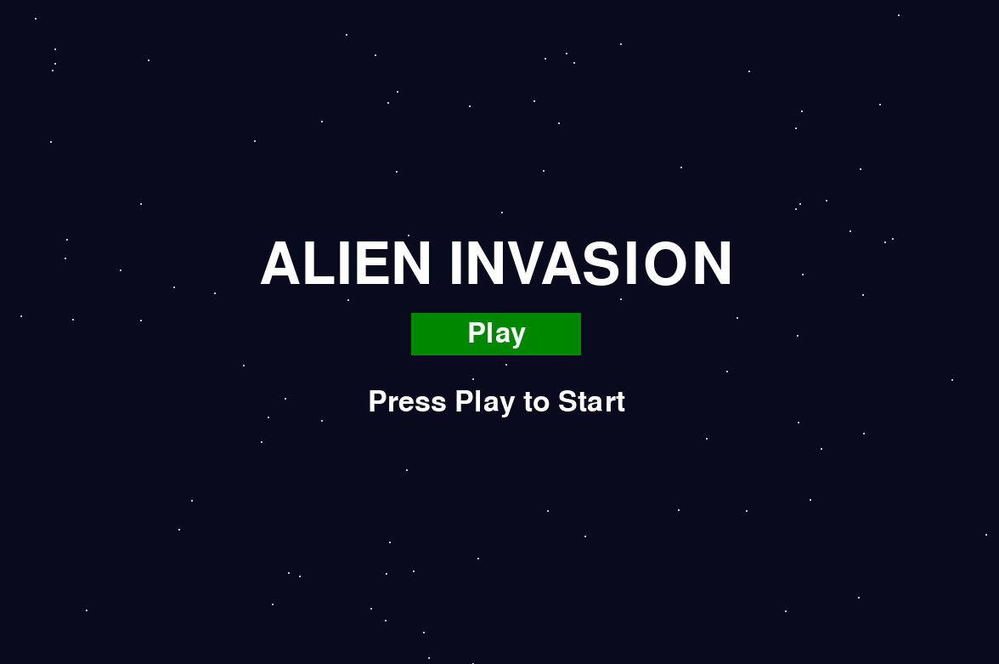
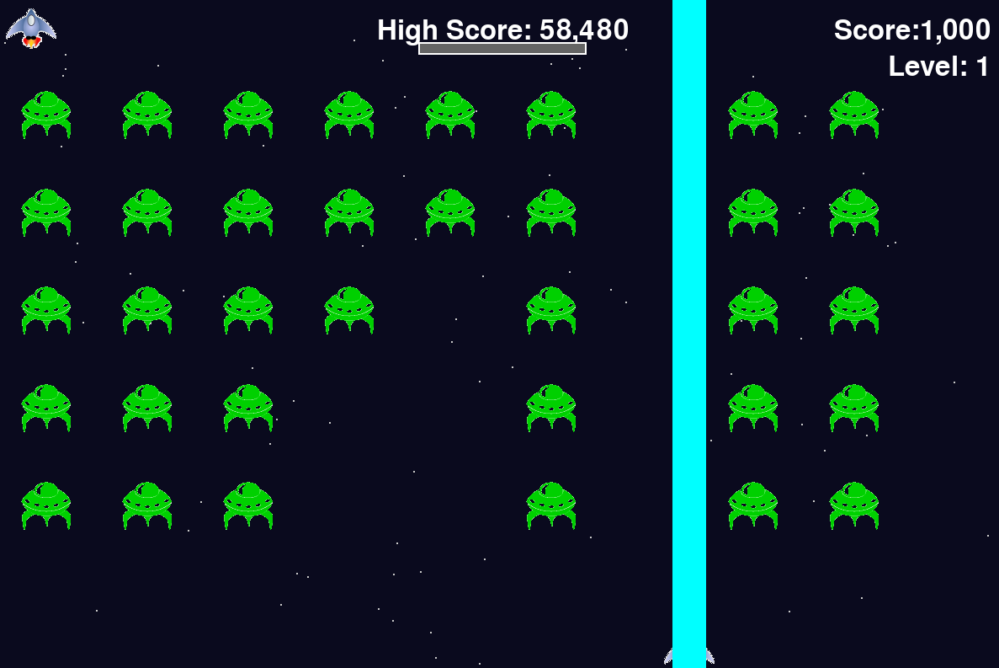
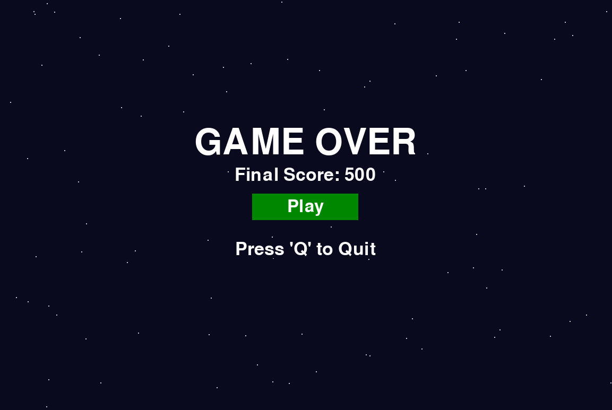

# 🛸 Alien Invasion - Enhanced Edition (外星人入侵：增强版)

  

**外星人要入侵地球了！扣 1 和我一起积攒能量，释放终极激光！**

---

## 📝 项目摘要 (Abstract)

本项目是基于经典 Python 教学案例《Alien Invasion》进行的**深度重构与功能扩展**。作为 Python 程序设计课程的进阶实验项目，本项目在原版基础上引入了**面向对象设计模式 (OOP)**、**技能充能系统**、**粒子背景特效**以及**模块化 UI 架构**。

相比于基础教程版本，本项目极大地提升了游戏的可玩性与视觉表现——新增了**激光贯穿大招**、**动态星空**及**沉浸式音效反馈**。经过测试，本项目可以在 **Python 3.11.14** 环境下完美运行。


## ✨ 核心特性 (Key Features)

### 1. ⚔️ 进阶战斗系统
*   **技能充能机制 (Skill Charge Bar)**：
    *   引入 RPG 元素的资源管理。屏幕顶部设有能量条，每击杀 1 个外星人可积累 1 格能量。
    *   **UI 动态反馈**：能量条颜色随进度变化（灰色 ➝ 黄色 ➝ 金色）。
*   **终极技能 - 激光贯穿 (Ultimate Laser)**：
    *   当能量条积满 5 格（变更为金色状态）时，玩家可按 `Up` 键释放。
    *   激光具有独立的视觉特效与宽判定范围，可**瞬间清除飞船前方的一整列敌人**，带来爽快的清屏体验。

### 2. 🎨 视觉与 UI 增强
*   **模块化 UI 管理**：通过 `UIManager` 类独立处理 `Start Screen`（极简开始菜单）与 `Game Over`（结算界面），逻辑解耦，交互更清晰。
*   **动态星空 (Dynamic Starfield)**：摒弃单调纯色背景，使用 `Star` 类实时生成随机分布、随机亮度的动态星空，增强宇宙深空的沉浸感。
*   **素材优化**：修复了原版素材在深色背景下的白边问题，视觉效果更加平滑。

### 3. 🎵 沉浸式音频
*   **Sound Manager**：封装了独立的音频管理类，统一控制所有声音资源。
*   **完整音效**：包含 BGM 循环播放，以及射击、技能释放、敌人爆炸、游戏结束的独立音效。

### 4. 💾 数据持久化
*   **最高分存档**：游戏会自动读取和保存历史最高分（`high_score.json`），无论何时关闭游戏，荣誉数据都不会丢失。

---

## 📂 项目结构 (Project Structure)

本项目核心代码全部为 Python 模块，采用了分层设计：

*   **`main_alien_invasion.py`**：[核心] **程序主入口**，负责游戏主循环与事件监听
*   **`settings.py`**：[配置] 屏幕参数、速度因子、技能参数
*   **`game_stats.py`**：[数据] 统计信息（分数、最高分、等级、状态）
*   **`ui_manager.py`**：[视图] 界面管理器，绘制开始/结束屏幕
*   **`button.py`**：[组件] UI 按钮类，处理点击交互
*   **`scoreboard.py`**：[视图] 游戏内 HUD 显示（分数、等级、余命）
*   **`sound_manager.py`**：[音频] 音效与背景音乐统一管理
*   **`skill_bar.py`**：[功能] 技能充能条逻辑与绘制
*   **`laser.py`**：[实体] 激光大招实体类
*   **`star.py`**：[视觉] 动态星空背景生成
*   **`ship.py`**：[实体] 玩家飞船类
*   **`alien.py`**：[实体] 外星人类
*   **`bullet.py`**：[实体] 普通子弹类
*   **`high_score.json`**：[文件] 自动生成的最高分存档
*   **`images/` & `sounds/`**：[资源] 图像与音频素材库

---

## 💻 环境依赖与复现 (Environment)

为了确保实验结果的一致性，本项目提供了两种环境搭建方式（Conda 或 Pip），请任选其一。

### 1. 核心版本要求
*   **Python**: `3.11.14`
*   **Pygame**: `2.6.1`
*   **SDL**: `2.28.4` (通常由 Pygame 底层依赖自动提供)

### 2. 环境搭建 (任选一种方式)

#### 方式 A：使用 Conda (推荐)
如果你安装了 Anaconda 或 Miniconda，可以使用以下命令快速创建隔离环境。

```bash
# 1. 创建 Python 3.11.14 的虚拟环境
conda create -n alien_env python=3.11.14

# 2. 激活环境
conda activate alien_env

# 3. 安装依赖
pip install pygame==2.6.1
```

### 方式 B：使用 Python 原生 venv

如果你使用的是标准 Python 安装，可以使用内置的 `venv` 模块。

**Windows:**

```bash
# 1. 创建虚拟环境
python -m venv venv

# 2. 激活环境
.\venv\Scripts\activate

# 3. 安装依赖
pip install pygame==2.6.1
```

**macOS / Linux:**
```bash
# 1. 创建虚拟环境
python3 -m venv venv

# 2. 激活环境
source venv/bin/activate

# 3. 安装依赖
pip install pygame==2.6.1
```

### 3. 运行游戏
在终端中运行主程序：
```bash
python alien_invasion.py
```
---

## 🎮 操作指南 (Controls)

| 按键 / 操作 | 功能描述 |
| :--- | :--- |
| **⬅️ Left / ➡️ Right** | 控制飞船向左 / 向右移动 |
| **Space (空格)** | 发射普通子弹 |
| **⬆️ Up (上箭头)** | **释放激光大招** (需能量条满 5 格) |
| **Q(英文键盘)** | 退出游戏 (在任意时刻或结束界面有效) |
| **鼠标点击 Play** | 开始游戏 / 重新开始 |

---

> **Note**: 请确保项目根目录下存在 `images/` 和 `sounds/` 文件夹，以保证图像和声音能正常加载。

---

## 📷 游戏画面概览 (Gameplay Gallery)

> *注：本项目采用了 Pygame 进行图形渲染，结合 `Star` 类实现了动态粒子背景，并优化了 UI 的交互反馈。*

| **游戏截图 (Preview)** | **功能解析 (Technical Details)** |
| :---: | :--- |
|  | **1. 沉浸式开始菜单 (Start Screen)**<br><br>**UI 模块 (`ui_manager.py`)**<br><ul><li>采用极简风格的按钮设计与交互逻辑。</li><li>背景不再是静态图片，而是由代码实时生成的**动态星空**。</li><li>解决了原版教程中素材在深色背景下的白边问题。</li></ul> |
|  | **2. 终极技能释放 (Ultimate Laser)**<br><br>**战斗模块 (`laser.py` & `skill_bar.py`)**<br><ul><li>**充能机制**：顶部能量条随击杀数积累（灰 ➝ 黄 ➝ 金）。</li><li>**大招释放**：当能量条变为金色时，按 `Up` 键释放激光。</li><li>**碰撞检测**：使用宽判定矩形，瞬间清除前方一整列敌人。</li></ul> |
|  | **3. 数据结算与存档 (Game Over)**<br><br>**数据模块 (`game_stats.py`)**<br><ul><li>游戏结束时，系统会立即结算当前得分。</li><li>**持久化存储**：利用 JSON 技术将最高分写入 `high_score.json`。</li><li>支持快捷键 `Q` 退出或点击按钮一键重试。</li></ul> |

---